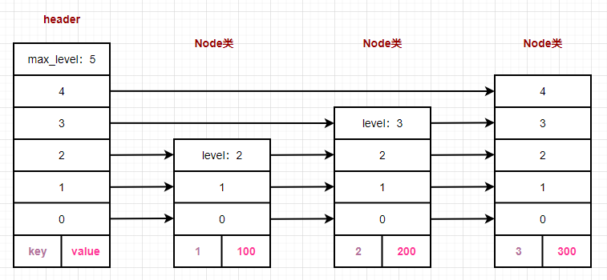

# SkipList

## 1、SkipList类的设计

跳表也是key-value的形式存储，跳表(skip list) 对标的是平衡二叉树(AVL Tree)，是一种插入/删除/搜索都是

O(logn)的数据结构。在一些热门的项目里用来替代平衡二叉树，如redis,leveldb等。

**我的理解：跳表其实就是建立多层索引（多层链表）。**

显然：每列的key值都是一样的。此外，每个结点到底有多少层是由概率来计算的。


上图跳表中的数字是key值，可见，如果要查找key值为12的结点，从head结点开始，5跳就可以找到了。具体的

跳跃规则写在代码中了。

### **1.1 Node类的设计**

Node类用来存储键值对，每个节点有多个指针，用来指向不同层的下一个节点。


```c++
// 使用模版来实现kv键值对
//Class template to implement node
template<typename K, typename V> 
class Node {
public:
    Node() {}                 // 无参构造
    Node(K k, V v, int);      // 有参构造
    ~Node();                  // 析构函数
    K get_key() const;        // 获取key
    V get_value() const;      // 获取value
    void set_value(V);        // 设置value
    Node<K, V> **forward;     // 指针数组，每个指针代表一层，指向下一个节点
  	// forward是一个指针数组，既是数组名，也是数组首地址。
  	// 存储的类型是Node<K, V>*，即Node<K, V>类型的指针
  	// 每个Node<K, V>*代表一层，指向该层的下一个Node节点
  	// forward[0]存储的是第0层的指针，以此类推，forwar[i]存储的是第i + 1层的指针
  	// 每一层通过forward链接起来
  	// 通过forward[i]控制层数；通过node = node->forward[i]控制在每一层移动
    int node_level;           // 节点的高度
private:
    K key;
    V value;
};
```

#### **1.1.1 有参构造函数的实现**

```c++
template<typename K, typename V> 
Node<K, V>::Node(const K k, const V v, int level) {
    this->key = k;
    this->value = v;
    this->node_level = level; 
    // level + 1, because array index is from 0 - level
    this->forward = new Node<K, V>*[level+1];
		// 将申请的空间清空 
    memset(this->forward, 0, sizeof(Node<K, V>*)*(level+1));
};
```

#### 1.1.2 其它成员函数

```c++
// 析构函数
template<typename K, typename V> 
Node<K, V>::~Node() {
    delete []forward;
};
// 获得key值
template<typename K, typename V> 
K Node<K, V>::get_key() const {
    return key;
};
// 获得value值 
template<typename K, typename V> 
V Node<K, V>::get_value() const {
    return value;
};
// 设置value值
template<typename K, typename V> 
void Node<K, V>::set_value(V value) {
    this->value=value;
};
```

### 1.2 SkipList类的设计

用来对多个键值对进行管理，同时提供对外的接口，增删查等操作。


```c++
// Class template for Skip list
template <typename K, typename V> 
class SkipList {

public: 
    SkipList(int);                         	// 构造函数，初始化最大层
    ~SkipList();                            // 析构函数
    int get_random_level();                 // 随机获取一个节点的层数，不简单
    Node<K, V>* create_node(K, V, int);     // 创建新节点
    int insert_element(K, V);               // 插入(K, V)元素
    void display_list();                    // 显示跳表
    bool search_element(K);                 // 查找元素
    void delete_element(K);                 // 删除元素
    void dump_file();                       // 导出数据
    void load_file();                       // 加载数据
    int size();                             // 大小

private:
  	// 从string中获得key和value
    void get_key_value_from_string(const std::string& str, std::string* key, std::string* value);
    // 判断字符串是否合法
  	bool is_valid_string(const std::string& str);

private:    
    int _max_level;                 // 跳表的最高层
    int _skip_list_level;           // 跳表的当前层
    Node<K, V> *_header;            // 头节点指针【不存数据】
    std::ofstream _file_writer;     // 文件写操作
    std::ifstream _file_reader;     // 文件读操作
    int _element_count;             // 统计跳表当前的个数
};
```

#### 1.2.1 创建新节点

```c++
// 创建新节点
template<typename K, typename V>
Node<K, V>* SkipList<K, V>::create_node(const K k, const V v, int level) {
    Node<K, V> *n = new Node<K, V>(k, v, level);
    return n;
}
```

#### 1.2.2 插入节点

示意图

```c++
// Insert given key and value in skip list 
// return 1 means element exists  
// return 0 means insert successfully
/* 
                           +------------+
                           |  insert 50 |
                           +------------+
level 4     +-->1+                                                      100
                 |
                 |                      insert +----+
level 3         1+-------->10+---------------> | 50 |          70       100
                                               |    |
                                               |    |
level 2         1          10         30       | 50 |          70       100
                                               |    |
                                               |    |
level 1         1    4     10         30       | 50 |          70       100
                                               |    |
                                               |    |
level 0         1    4   9 10         30   40  | 50 |  60      70       100
                                               +----+
```

在跳表中插入给定的key和value

结果返回1表示该元素已经存在；结果返回0表示插入成功

**update指针数组记录要插入节点的每一层的前继节点，这样节点插入的时候就可以设置好每一层指针，每一层都**

**要做一个链表插入的动作。**

```cpp
node->next = pre->next;    // 要插入的节点的next指向前一个节点的next
pre->next = node;          // 要插入的节点的next指向要插入节点
```


假定原理没有<3, 300>，现在要插入这个node。

```c++
template<typename K, typename V>
int SkipList<K, V>::insert_element(const K key, const V value) {
    mtx.lock();          										 // 加锁
    Node<K, V> *current = this->_header;     // 指向头节点指针【头节点不存数据】

    // update 是放置 node->forward[i] 应该稍后操作的节点的数组
  	// update指针数组记录要插入节点的每一层的前继节点，
    // 这样节点插入的时候就可以设置好每一层指针，每一层都要做一个链表插入的动作。
  
  	// 创建内存空间
  	Node<K, V> *update[_max_level+1];
  	// 清空内存空间
    memset(update, 0, sizeof(Node<K, V>*)*(_max_level+1));  
		
  	// 从本节点的高层开始遍历
  	// 如果current的下一个节点【同层】不为空 && current的下一个节点的key小于要插入的key
  	// current在本层一直往后移
    for(int i = _skip_list_level; i >= 0; i--) {
        while(current->forward[i] != NULL && current->forward[i]->get_key() < key) {
            current = current->forward[i]; 
        }
      	// 此时current指向的是第一个大于要插入key的节点
      	// 然后逐层存储，update[i]存储的是第i层大于key（要插入的key）的前继节点
        update[i] = current;
    }

    // current是插入的key的前一个节点
  	// 将current置为前current的低0层
  	current = current->forward[0];
  
  	// 找到，返回1
    if (current != NULL && current->get_key() == key) {
        std::cout << "key: " << key << ", exists" << std::endl;
        mtx.unlock();
        return 1;
    }

  	// 如果不存在，就创建
  	if (current == NULL || current->get_key() != key ) {
      	// 为节点生成随机级别
        int random_level = get_random_level();

        // 如果随机级别大于跳表当前的级别，使用指向头节点的指针初始化update
      	if (random_level > _skip_list_level) {
            for (int i = _skip_list_level + 1; i < random_level + 1; i++) {
                update[i] = _header;
            }
            _skip_list_level = random_level;
        }
      	// 使用随机生成级别创建新节点
        Node<K, V>* inserted_node = create_node(key, value, random_level);

      	// 插入节点
        for (int i = 0; i <= random_level; i++) {
          	// 插入节点关键代码
            inserted_node->forward[i] = update[i]->forward[i];
            update[i]->forward[i] = inserted_node;
        }
        std::cout << "Successfully inserted key:" << key << ", value:" << value << std::endl;
        _element_count ++;      // 统计数自增
    }
    mtx.unlock();        // 解锁
    return 0;
}
```

#### 1.2.3 显示跳表



从第0层开始遍历，

```c++
/*
	每一层通过forward链接起来。
	总的来说就是：
		从最底层开始遍历，遍历完一层，再往上遍历。
*/

// Display skip list 
template<typename K, typename V> 
void SkipList<K, V>::display_list() {

    std::cout << "\n*****Skip List*****"<<"\n"; 
    for (int i = 0; i <= _skip_list_level; i++) {
      	// node指向的是第i层的下一个节点
        Node<K, V> *node = this->_header->forward[i]; 
        std::cout << "Level " << i << ": ";
        while (node != NULL) {
            std::cout << node->get_key() << ":" << node->get_value() << ";";
          	// node在第i层一直后移，直到指向为空，开始下一层的遍历
            node = node->forward[i];
        }
        std::cout << std::endl;
    }
}
```

#### 1.2.4 导出数据

```c++
// Dump data in memory to file 
template<typename K, typename V> 
void SkipList<K, V>::dump_file() {

    std::cout << "dump_file-----------------" << std::endl;
  	// 打开STORE_FILE文件
    _file_writer.open(STORE_FILE);
  	// 拿到头节点【不存数据】的第0层的下一个数据【第一个数据】
    Node<K, V> *node = this->_header->forward[0]; 

    while (node != NULL) {
      	// 写数据
        _file_writer << node->get_key() << ":" << node->get_value() << "\n";
      	// 输出
        std::cout << node->get_key() << ":" << node->get_value() << ";\n";
      	// 在本层一直后移
        node = node->forward[0];
    }

    _file_writer.flush();      // 刷新写缓冲区
    _file_writer.close();      // 关闭写
    return ;
}
```

#### 1.2.5 加载数据

```c++
template<typename K, typename V> 
void SkipList<K, V>::load_file() {
		// 读STORE_FILE
    _file_reader.open(STORE_FILE);
    std::cout << "load_file-----------------" << std::endl;
    std::string line;
    std::string* key = new std::string();
    std::string* value = new std::string();
  	// 读一行，读到line中
    while (getline(_file_reader, line)) {
      	// 从line中获取key和value
        get_key_value_from_string(line, key, value);
      	// 为空，跳过
        if (key->empty() || value->empty()) {
            continue;
        }
      	// 将(key, value)插入到跳表中
        insert_element(*key, *value);
      	// 输出
        std::cout << "key:" << *key << "value:" << *value << std::endl;
    }
  	// 关闭读文件操作符
    _file_reader.close();
}
```

#### 1.2.6 跳表大小

```c++
// 获得当前跳表的大小
template<typename K, typename V> 
int SkipList<K, V>::size() { 
    return _element_count;
}
```

#### 1.2.7 获得key和value

```c++
// 从string获得key和value
// key和value是传入传出参数
// string delimiter = ":";
template<typename K, typename V>
void SkipList<K, V>::get_key_value_from_string(const std::string& str, std::string* key, std::string* value) {
    if(!is_valid_string(str)) {
        return;
    }
    *key = str.substr(0, str.find(delimiter));    // 截取[0， 有:的位置）
    *value = str.substr(str.find(delimiter)+1, str.length());   // 截取[有:的位置 + 1, 末尾]
}
```

#### 1.2.8 检查合法数据

```c++

template<typename K, typename V>
bool SkipList<K, V>::is_valid_string(const std::string& str) {
    if (str.empty()) {
        return false;
    }
  	// 查找字符串a是否包含子串b,不是用strA.find(strB) > 0 
  	// 而是 strA.find(strB) != string:npos。【有点像容器里面的end()】
  	// 其中string:npos是个特殊值，说明查找没有匹配
    if (str.find(delimiter) == std::string::npos) {
        return false;
    }
    return true;
}
```

#### 1.2.9 删除数据

删除和插入相似，先记录要删除节点的每一层的前继节点，然后每一层做一个链表删除节点的操作。

```cpp
prev->next = node->next;      // node是要删除的节点
delete node;
```


```c++
template<typename K, typename V> 
void SkipList<K, V>::delete_element(K key) {
    mtx.lock();                // 加锁
    Node<K, V> *current = this->_header;    // 保存头节点【current中不存数据】
    Node<K, V> *update[_max_level+1];       // 定义数组，存储要删除节点的前继节点【每一层都要存储】
    memset(update, 0, sizeof(Node<K, V>*)*(_max_level+1));    // 初始化为0

    // 从最高层开始遍历
  	// current的下一个节点不为空 && current下一个节点的key < 要删除的key
  	// current在本层一直后移
    for (int i = _skip_list_level; i >= 0; i--) {
        while (current->forward[i] !=NULL && current->forward[i]->get_key() < key) {
            current = current->forward[i];
        }
      	// 跳出while循环时，current的下一个节点为空 或者 current下一个节点的key > 要删除的key
      	// 记录要删除节点的前继节点。update[i]存储的是第i层要删除节点的前驱节点
        update[i] = current;
    }
		// 将current置为原current的下一个节点的最底层【因为最底层数据最全】
  	// 也就是说current是要删除的节点
    current = current->forward[0];
  	// 找到对应的节点，接下来就是删除
    if (current != NULL && current->get_key() == key) {
       	// 从最底层开始遍历
        for (int i = 0; i <= _skip_list_level; i++) {
          	// 记录删除节点前驱节点的下一个节点不是要删除的节点，直接跳出循环.
            if (update[i]->forward[i] != current) 
                break;
          	// 删除节点
            update[i]->forward[i] = current->forward[i];
        }
       
      	// 删掉没有元素的那层
      	// 初始化的时候，是按最大层数初始化的。
      	// 每个节点都有一个level（层数）,从level到_skip_list_level没有数据，删掉。
        while (_skip_list_level > 0 && _header->forward[_skip_list_level] == 0) {
            _skip_list_level --; 
        }	
      	delete current;         // 释放内存 
        std::cout << "Successfully deleted key "<< key << std::endl;
        _element_count --;      // 跳表节点数量自减
    }
    mtx.unlock();
    return;
}
```

#### 1.2.10 查找数据

```
// Search for element in skip list 
/*
                           +------------+
                           |  select 60 |
                           +------------+
level 4     +-->1+                                                      100
                 |
                 |
level 3         1+-------->10+------------------>50+           70       100
                                                   |
                                                   |
level 2         1          10         30         50|           70       100
                                                   |
                                                   |
level 1         1    4     10         30         50|           70       100
                                                   |
                                                   |
level 0         1    4   9 10         30   40    50+-->60      70       100
*/
```

从当前最大层数开始查找，如果要查找的键（key）比cur的下一个节点的键（key）大，cur就往后移；

找到大于等于key的第一个节点，如果那个节点等于key，就说明找到了，否则就没有该key。


```c++
/*
	思路：
		（1）从最高层开始遍历，current指向_header节点【该节点不存数据】
		（2）如果current的下一个节点不为空【同一层】 && 要查找的key大于current的下一个节点的key
		（3）current在本层一直后移。
		（4）跳出循环后，会找到大于要查找的key的前一个节点，然后，将current的移至key（如果有的话）的最底层，
				因为最底层的数据最全
		（5）判断是否找到
*/

template<typename K, typename V> 
bool SkipList<K, V>::search_element(K key) {

    std::cout << "search_element-----------------" << std::endl;
    Node<K, V> *current = _header;

  	// 从_header的最高层开始遍历
    for (int i = _skip_list_level; i >= 0; i--) {
      	// current的指针不为空 && current的下一个的key < key
      	// current后移到下一个Node<K, V>
        while (current->forward[i] && current->forward[i]->get_key() < key) {
            current = current->forward[i];
        }
    }
  	// 跳出上面这个for循环，满足current->forward[i]为空或者找到第一个大于key的节点
  	// 或者都满足

  	// 将current置为原current的下一个节点的最底层
    //reached level 0 and advance pointer to right node, which we search
    current = current->forward[0];

  	// 找到满足的key
    // if current node have key equal to searched key, we get it
    if (current && current->get_key() == key) {
        std::cout << "Found key: " << key << ", value: " << current->get_value() << std::endl;
        return true;
    }
		// 否则没有找到
    std::cout << "Not Found Key:" << key << std::endl;
    return false;
}
```

#### 1.2.11 有参构造

```c++
// construct skip list
template<typename K, typename V> 
SkipList<K, V>::SkipList(int max_level) {
    this->_max_level = max_level;
    this->_skip_list_level = 0;
    this->_element_count = 0;

    // create header node and initialize key and value to null
    K k;
    V v;
    this->_header = new Node<K, V>(k, v, _max_level);
};
```

#### 1.2.12 析构函数

```c++
template<typename K, typename V> 
SkipList<K, V>::~SkipList() {

    if (_file_writer.is_open()) {
        _file_writer.close();
    }
    if (_file_reader.is_open()) {
        _file_reader.close();
    }
    delete _header;
}
```

#### 1.2.13 得到随机的层数

```c++
template<typename K, typename V>
int SkipList<K, V>::get_random_level(){
    int k = 1;
  	// 随机生成一个数在[0-1]之间
  	// 如果是1，则k加1
  	// 如果是0，则不处理k
    while (rand() % 2) {
        k++;
    }
  	// 处理完后，k要么为1，要么为2
  	// 取k和_max_level的较小者
    k = (k < _max_level) ? k : _max_level;
    return k;
};
```

#### 1.2.14 测试

```cpp
#include <iostream>
#include "skiplist.h"
#define FILE_PATH "./store/dumpFile"

int main() {

  // 键值中的key用int型，如果用其他类型，需要自定义比较函数       √
  // 而且如果修改key的类型，同时需要修改skipList.load_file函数
  SkipList<int, std::string> skipList(6);
	skipList.insert_element(1, "鲁智深"); 
	skipList.insert_element(3, "武松"); 
	skipList.insert_element(7, "林冲"); 
	skipList.insert_element(8, "卢俊义"); 
	skipList.insert_element(9, "石秀"); 
	skipList.insert_element(19, "史进"); 
	skipList.insert_element(19, "公孙胜"); 

   std::cout << "skipList size:" << skipList.size() << std::endl;

   skipList.dump_file();

   // skipList.load_file();

   skipList.search_element(9);
   skipList.search_element(18);


   skipList.display_list();

   skipList.delete_element(3);
   skipList.delete_element(7);

   std::cout << "skipList size:" << skipList.size() << std::endl;

   skipList.display_list();
}
```

